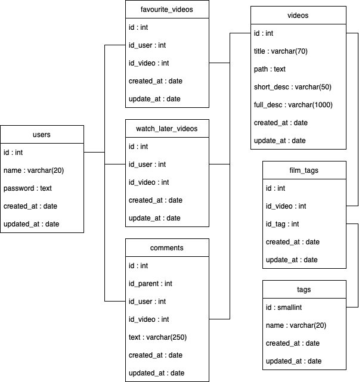

# **Portal treningowy**
Strona internetowa udostępniajaca materiały do nauki z różnych dziedzin i zagadnień technicznych

## Release 1 - baza danych i API
* Jako administrator mogę:
  * Modyfikować dane użytkowników:
    * wyświetlić informacje o wszystkich uzytkownikach
    * wyświetlić informacje o konkretnym użytkowniku
    * dodać nowego użytkownika
    * usunąć istniejącego użytkownika
    * zaktualizować dane istniejącego użytkownika
  * Modyfikować dane filmów:
    * wyświetlić informacje o wszystkich filmach
    * wyświetlić informacje o konkretnym filmie
    * dodać informacje o nowym filmie
    * usunąć informacje o istniejacym filmie
    * zaktualizować informacje o istniejacym filmie
  * Modyfikować dane tagów do filmów:
    * wyświetlić informacje o wszystkich tagach
    * dodać nowy tag filmu
    * zmienić nazwę istniejącego tagu
  * Modyfikować dane komentarzy:
    * wyświetlić informacje o komentarzach do istniejącego filmu
    * wyświetlić informacje o komentarzach istniejącego użytkownika
    * usunąć treść istniejącego komentarza
* Jako użytkownik mogę:
  * wyświetlić informacje o swoim użytkowniku
  * wyświetlić informacje o swoich komentarzach
  * wyświetlić informacje o filmach ze swojej listy 'do obejrzenia'
  * wyświetlić informacje o filmach ze swojej listy 'ulubione'
* Założenia:
  * Baza danych: postgreSQL
  * Backend: PHP (laravel)
  * Frontend: JS (Next.js)
  * Nowe tagi mogą mieć max. 20 znaków długości
* Uwagi:
  * Starter-pack: https://github.com/laravel/breeze-next
  

## Release 2 - logowanie
* Jako administrator mogę:
  * Działać na własnym koncie:
    * Zalogować się na swoje konto
    * Wylogować się ze swojego konta
    * Odczytać informacje o swoim koncie
    * Zmienić swoje hasło
    * Zmienić swoją nazwę użytkownika
  * Działać na koncie zwykłego użytkownika:
    * Odczytać informacje o koncie dowolnego zwykłego użytkownika
    * Zmienić hasło dowolnego zwykłego użytkownika
    * Zmienić nazwę użytkownika dowolnego zwykłego użytkownika
    * Usunąć konto dowolnego zwykłego użytkownika
* Jako użytkownik mogę:
  * Zalogować się na swoje konto
  * Wylogować się ze swojego konta
  * Odczytać informacje o swoim koncie
  * Zmienić swoje hasło
  * Zmienić swoją nazwę użytkownika
  * Usunąć swoje konto
* Założenia:
  * Nazwa użytkownika może zawierać litery małe i duże, cyfry oraz znak '_'
  * Nazwa użytkownika musi być unikalna
  * Nazwa użytkownika może mieć max. 20 znaków długości
  * Hasło może zawierać litery małe i duże, cyfry oraz znaki specjalne
  * Hasło musi zawierać co najmniej jedną literę małą, jedną dużą, jedną cyfrę i jeden znak specjalny oraz mieć 8+ znaków długości
  * Nowe hasło nie może być takie same jak stare hasło 
  

## Release 3 - wyświetlacz filmów
* Jako użytkownik mogę:
  * Uruchomić odtwarzanie filmu
  * Zatrzymać odtwarzanie filmu
  * Jednym kliknięciem przewinąć wideo o 10s do przodu
  * Jednym kliknięciem przewinąć wideo o 10s do tyłu
  * Zacząć wideo z dowolnego progu czasowego (np. zaczynając od 1:34)
* Założenia:
  * Wideo nie uruchamia się automatycznie
* Uwagi:
  * Cloudinary - https://cloudinary.com/blog/autoplay-a-video-on-a-next-js-landing-page
  

## Release 4 - wyszukiwarka filmów i karta filmu
* Jako administrator mogę:
  * Dodać nowy film:
    * Dodać nowy plik z filmem
    * Dodać nowy tytuł filmu
    * Dodać nowy tag do filmu
    * Dodać nowy krótki opis filmu
    * Dodać nowy pełny opis filmu
  * Zmodyfikować istniejący film:
    * Zmienić ścieżkę do pliku wideo
    * Zmienić tytuł filmu
    * Zmienić tagi filmu
    * Zmienić krótki opis filmu
    * Zmienić pełen opis filmu
  * Usunąć istniejący film
* Jako użytkownik mogę:
  * W wyszukiwarce:
    * wpisać słowo klucz, i otrzymać listę filmów których tytuły zawierają to słowo klucz
    * wybrać tag, i po wpisaniu słowa klucz otrzymać tylko filmy posiadające ten tag
    * Na otrzymanej liście zobaczyć tytuł filmu, jego tagi i krótki opis
    * Na otrzymanej liście może kliknąć w film, aby przenieść się na stronę tego filmu
  * Na stronie filmu:
    * Korzystać z wyświetlacza filmu
    * Kliknąć przycisk, aby dodać ten film do listy 'do obejrzenia'
    * Kliknąć przycisk, aby dodać ten film do listy 'ulubione'
* Założenia:
  * Każdy film musi mieć koniecznie tytuł (max. 70 znaków)
  * Każdy film może mieć też opcjonalnie krótki opis (50 znaków) i pełen opis (1000 znaków)
  * Usunięcie filmu usunie także automatycznie odpowiedający mu plik na serwerze
  * Wideo powinno być w formacie .mp4
  * Wyszukując po słowie klucz, w pierwszej kolejności listują się filmy które zaczynają się na dany klucz, potem reszta filmów które w tytule zawierają klucz
  * Karta filmu składa się z wyświetlacza na górze, pełnego opisu pod nim i w przyszłości sekcji komentarzy pod opisem
  

## Release 5 - sekcja komentarzy
* Jako administrator mogę:
  * Działać na swoich komentarze:
    * Dodawać nowy komentarz
    * Dodawać komentarz w odpowiedzi do innego komentarza
    * Edytować istniejący komentarz
    * Usunąć istniejący komentarz
  * Działać na komentarzach zwykłych użytkowników:
    * Usunąć istniejący komentarz
* Jako użytkownik mogę:
  * Dodawać nowy komentarz
  * Dodawać komentarz w odpowiedzi do innego komentarza
  * Edytować istniejący komentarz
  * Usunąć istniejący komentarz
* Założenia:
  * Sekcja komentarzy znajduje się pod opisem filmu
  * Komentarz ma maksymalną długość 250 znaków
  

## Project bazy danych

  

## Project API
* /api/users
  * GET / 
    * Zwraca dane wszystkich zarejestrowanych użytkowników
  * GET /{id} 
    * Zwraca dane użytkownika o danym id
  * GET /nameHas/{key}
    * Zwraca dane użytkowników którego nazwa zawiera klucz
  * PUT / 
    * Parametry: [{'name': string, 'password': string}] 
    * Dodaje nowego użytkownika do bazy danych
  * POST /{id} 
    * Parametry: [{'name': string, 'password': string}] 
    * Aktualizuje dane użytkownika o danym id
  * DELETE /{id} 
    * Usuwa z bazy danych użytkownika o danym id
---
* /api/videos
  * GET / 
    * Zwraca dane wszystkich filmów
  * GET /{id} 
    * Zwraca dane filmu o danym id
  * GET /titleHas/{key}
    * Zwraca dane filmów które w tytule zawierają klucz
  * GET /tag/{tagId}
    * Zwraca dane filmów które mają dany tag
  * GET /titleHas/{key}/tag/{tagId}
    * Zwraca dane filmów które w tytule zawierają klucz i mają dany tag
  * PUT / 
    * Parametry: [{'title': string, 'path': string, 'short_desc?': string, 'full_desc?': string}] 
    * Dodaje nowy film do bazy danych
  * POST /{id} 
    * Parametry: [{'title?': string, 'path?': string, 'short_desc?': string, 'full_desc?': string}] 
    * Aktualizuje dane filmu o danym id
  * DELETE /{id} 
    * Usuwa z bazy danych film o danym id
---
* /api/videos/favourites
  * GET / 
    * Zwraca dane wszystkich ulubionych filmów
  * GET /{id} 
    * Zwraca dane ulubionego filmu o danym id
  * GET /user/{id} 
    * Zwraca informacje o id wszystkich filmów ulubionych przez użytkownika o danym id
  * GET /video/{id} 
    * Zwraca informacje o id wszystkich użytkownikaów którzy zapisali film o danym id jako ulubiony
  * PUT / 
    * Parametry: [{'id_user': int, 'id_video': int}] 
    * Dodaje nowy ulubiony film do bazy danych
  * DELETE /{id} 
    * Usuwa z bazy danych ulubiony film o danym id
---
* /api/videos/watchLater
  * GET / 
    * Zwraca dane wszystkich filmów do obejrzenia
  * GET /{id} 
    * Zwraca dane filmu do obejrzenia o danym id
  * GET /user/{id} 
    * Zwraca informacje o id wszystkich filmów do obejrzenia zapisanych przez użytkownika o danym id
  * GET /video/{id} 
    * Zwraca informacje o id wszystkich użytkownikaów którzy zapisali film o danym id jako do obejrzenia
  * PUT / 
    * Parametry: [{'id_user': int, 'id_video': int}] 
    * Dodaje nowy film do obejrzenia do bazy danych
  * DELETE /{id} 
    * Usuwa z bazy danych film do obejrzenia o danym id
---
* /api/tags
  * GET / 
    * Zwraca dane o wszystkich tagach
  * GET /{id}
    * Zwraca dane o tagu o danym id
  * PUT / 
    * Parametry: [{'name': string}]
    * Dodaje nowy tag do bazy danych
  * POST /{id} 
    * Parametry: [{'name': string}]
    * Aktualizuje dane tagu o danym id
  * DELETE /{id} 
    * Usuwa z bazy danych tag o danym id
  * GET /video/{id}
    * Zwraca tagi filmu o danym id
  * PUT /video/{id_video}/tag/{id_tag}
    * Dodaje nowy tag do filmu o danym id
  * DELETE /video/{id}
    * Usuwa wszystkie tagi z filmu o danym id
  * DELETE /video/{id_video}/tag/{id_tag}
    * Usuwa tag o danym id z filmu o danym id
---
* /api/comments
  * GET /user/{id} 
    * Zwraca dane o wszystkich komentarzach użytkownika o danym id
  * GET /video/{id} 
    * Zwraca dane o wszystkich komentarzach do filmu o danym id
  * GET /video/{videoId}/user/{userId}
    * Zwraca dane o wszystkich komentarzach danego użytkownika do danego filmu
  * GET /clear/{id}
    * Zmienia treść komentarza o danym id na "Komentarz usunięty przez administrację"
  
---
<!-- 
## Release templete - 
* Jako administrator mogę:
  * to
* Jako użytkownik mogę:
  * to
* Założenia:
  * takie
  
-->